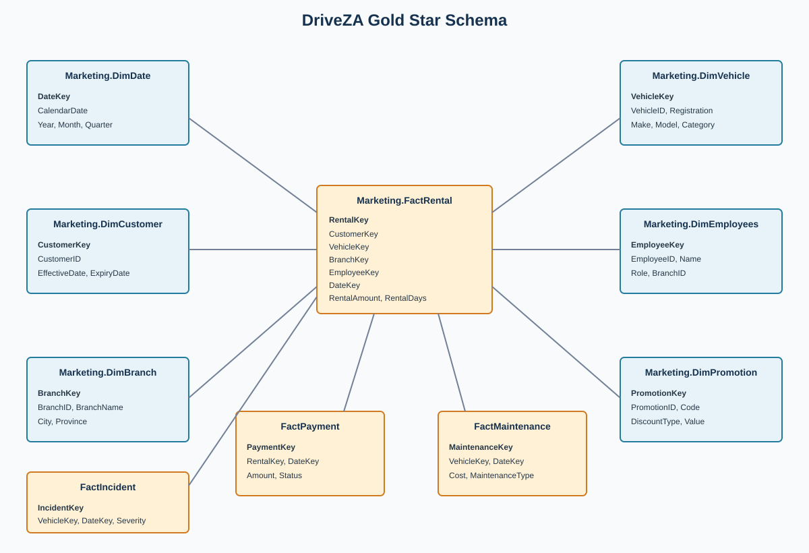

# DriveZA Holdings - Data Platform

> A Microsoft Fabric data platform that turns disconnected vehicle-rental data into governed, self-service analytics.


## Executive Summary

DriveZA Holdings is a fictional South African vehicle-rental company operating across nine provinces, more than 25 cities, and 32 branches with approximately 400 vehicles. Its customer, fleet, HR, branch, and payment information is distributed across systems that do not share the same structure or update process. This project brings those sources together on Microsoft Fabric and organizes them into raw, curated, and reporting-ready layers. The result is a traceable foundation for reliable dashboards, self-service analysis, and future AI and machine-learning use cases.

## Architecture Overview


Fabric Data Factory orchestrates ingestion and transformation, OneLake stores Delta data, and `WH_DRZ_GOLD` presents a dimensional model for reporting. The three layers have deliberately separate responsibilities:

| Layer | Purpose | Fabric asset |
|---|---|---|
| Bronze | Preserve raw source data and ingestion context | `LH_DRZ_BRONZE` and `DRIVEZA_FLEET` mirror |
| Silver | Clean, standardize, deduplicate, and incrementally merge data | `LH_DRZ_SILVER` |
| Gold | Serve reusable dimensions and facts for analytics | `WH_DRZ_GOLD` |

## Business Problem

- The rental platform, Bluebird Auto Rental Systems, manages bookings, customers, payments, and promotions on an on-premises SQL Server.
- Fleet operations use MiX by Powerfleet for vehicle tracking, incident logging, and maintenance scheduling. Its data lands in an Azure SQL Server managed by the fleet team.
- HR records are mastered in PaySpace and periodically exported as spreadsheets, while Branch Operations maintains branch managers and fleet capacity in a separate spreadsheet.
- This project uses SQL Server for the CRM, Snowflake to simulate the fleet team's Azure SQL Server and demonstrate a mirrored/shared external database pattern, and GitHub-hosted CSV files to simulate the HR and branch spreadsheet exports.
- The sources use different schemas, keys, delivery mechanisms, and refresh frequencies.
- Analysts must reconcile rental, payment, customer, vehicle, branch, employee, maintenance, and incident data before producing trusted metrics.
- Without shared controls, transformation logic is duplicated across reports and the path from source to KPI is difficult to audit.

## Solution Overview

The platform integrates four source feeds into Microsoft Fabric and applies source-appropriate ingestion patterns. Bronze preserves what arrived, Silver creates consistent Delta tables, and Gold provides a warehouse star schema for reporting. Configuration tables, watermarks, schema checks, and run logs make the process reusable and observable.

## Technology Stack

| Area | Technology |
|---|---|
| Cloud platform | Microsoft Fabric |
| Orchestration | Fabric Data Factory pipelines |
| Transformation | PySpark Fabric Notebooks and SQL scripts |
| Storage | OneLake with Delta Lake tables |
| Source systems | SQL Server 2022, Snowflake, and GitHub raw files |
| Serving | Fabric Warehouse with T-SQL and Direct Lake semantic model pattern |
| Governance | Microsoft Purview catalog and governance capabilities |
| Version control | GitHub with Fabric Git integration |

## Data Sources

| Operational source | Project substitute | Data domains | Fabric integration |
|---|---|---|---|
| Bluebird Auto Rental Systems, on-premises SQL Server | SQL Server CRM source | Customers, payments, rentals, promotions, reviews | Self-hosted Integration Runtime (SHIR) |
| MiX by Powerfleet data in fleet-managed Azure SQL Server | Snowflake database, mirrored into Fabric as `DRIVEZA_FLEET` | Vehicles, maintenance, incidents | Native connection and Fabric mirror |
| Branch Operations spreadsheet | GitHub-hosted CSV | Branches, manager assignments, fleet capacity | HTTP connector; full-load pattern |
| PaySpace HR export spreadsheet | GitHub-hosted CSV | Staff and employee reference data | HTTP connector; full-load pattern |

Snowflake and GitHub are deliberate project substitutes for the production-like source patterns above. They allow the implementation to demonstrate external database mirroring and file-based ingestion without requiring access to the fictional company's operational systems.

## Medallion Architecture

### Bronze

`LH_DRZ_BRONZE` is the raw landing and observability layer. It preserves source structure while adding ingestion context for replay, reconciliation, and lineage. CRM processing uses source `updated_at` watermarks; branch and staff files use full-load ingestion. Fleet data is made available through the mirrored `DRIVEZA_FLEET` database.

- Ingestion metadata records timestamps, source systems, source files, and load context.
- Schema-evolution checks compare incoming CRM structures with existing Bronze tables.
- Data-quality notebooks validate expected objects, row counts, and null patterns.
- Pipeline control, run-log, and failure records provide operational traceability.

### Silver

`LH_DRZ_SILVER` is the curated Delta Lake layer. The Silver transformation reads Bronze tables and the fleet mirror, then prepares stable tables for downstream modeling.

- Standardizes column names, data types, null tokens, and business values.
- Removes duplicates using configured business keys and ordering rules.
- Uses record hashes for change detection and efficient incremental processing.
- Applies Delta `MERGE` and overwrite patterns for inserts, updates, and first-load scenarios.
- Uses `metadata.silver_config`, `metadata.pipeline_control`, and `metadata.pipeline_run_log` for configuration and execution history.
- Expands pipe-delimited add-on data into child records where required.

### Gold

`WH_DRZ_GOLD` is the reporting and analytics layer. Warehouse stored procedures load a star schema from Silver, separating reusable dimensions from measurable business events.

The model contains six dimensions: `DimDate`, `DimCustomer`, `DimBranch`, `DimVehicle`, `DimEmployees`, and `DimPromotion`. It contains four facts: `FactRental`, `FactPayment`, `FactMaintenance`, and `FactIncident`. Customer history uses current-record tracking with effective and expiry dates, providing stable relationships for operational and commercial KPIs.

## Key Engineering Features

- **Incremental watermark loading:** Source `updated_at` values limit CRM extraction to changed records and persist repeatable pipeline state.
- **Metadata-driven processing:** Watermark, control, run-log, and Silver configuration tables centralize business keys, active flags, execution state, and transformation behavior.
- **Schema evolution:** Incoming structures are compared with existing Bronze schemas, with compatible additions recorded before transformation continues.
- **Delta Lake patterns:** Silver uses durable Delta tables for transactional writes, schema management, change detection, and replayable processing.
- **Merge and upsert logic:** Business keys and record hashes distinguish inserts, updates, and unchanged records while avoiding unnecessary rewrites.
- **Data quality checks:** Dedicated notebooks validate expected tables, row counts, null patterns, schema changes, and load outcomes.
- **Operational observability:** Pipeline run logs and failure records make each load traceable from orchestration through table-level processing.
- **Dimensional modeling:** Gold provides conformed dimensions and facts, including effective and expiry dates for changing customer attributes.

## Data Model



The Gold model is a rental-operations star schema. `FactRental` is the central business event and connects reporting activity to customer, vehicle, branch, employee, promotion, and date dimensions. Payment, maintenance, and incident facts provide additional financial and operational views.

## Governance

### Built

- Bronze, Silver, and Gold boundaries separate raw, curated, and reporting data.
- Source metadata, pipeline control, run logs, failure records, and schema-change logs support traceability.
- Business keys and transformation rules are managed through configuration tables.
- Lakehouse and warehouse assets provide distinct processing and consumption boundaries.

### Planned or Service-Managed

- Microsoft Purview catalog registration and automated lineage across Fabric assets.
- Classification and sensitivity labels for customer and employee data.
- Least-privilege workspace and item access policies.
- Certified semantic model, Fabric Data Agent, and Microsoft 365 Copilot configuration.

Purview, Power BI, Data Agent, and Copilot settings are service-level configurations and are not stored as repository files.

## Results / Metrics

The implemented scope provides the following measurable coverage:

| Metric | Current scope |
|---|---:|
| Integrated source feeds | 4 |
| Medallion layers | 3 |
| Gold dimensions | 6 |
| Gold fact tables | 4 |
| Gold tables | 10 |
| Loading patterns | Incremental and full-load |

The business result is one traceable path from disconnected operational systems to reusable analytics. The platform is designed to scale by adding metadata and source-specific configuration instead of duplicating an entire pipeline for every table.

## Lessons Learned / Design Decisions

- **Fabric as the platform:** A single environment covers orchestration, notebooks, OneLake, lakehouse processing, warehouse serving, and semantic-model foundations.
- **Three layers:** Separating raw preservation, curation, and presentation limits coupling and makes failures easier to isolate.
- **Metadata over duplication:** Watermarks, business keys, and control state vary by source and table, so configuration is more maintainable than bespoke pipelines.
- **Warehouse for Gold:** A relational star schema gives reporting users predictable joins and stable business entities after flexible lakehouse processing.
- **Source-specific ingestion:** SQL Server, Snowflake, and file feeds have different delivery and change patterns; applying one universal strategy would reduce reliability.

## Limitations & Future Improvements

- Source systems and data are synthetic; production use would require real connections, credentials, networking, and operational SLAs.
- Purview policies, sensitivity labels, access groups, Power BI reports, Data Agent, and Copilot settings are service-managed rather than stored here.
- Automated unit, integration, and data-reconciliation tests should be added around each source and layer.
- Future improvements include CI/CD validation, richer quality thresholds, SLA monitoring, late-arriving fact handling, and incremental refresh optimization.
- The curated model provides a foundation for forecasting, anomaly detection, and other governed AI/ML workloads.

## How to Explore This Repo

1. Start with the architecture diagram and Gold ERD in `architecture/`.
2. Review Bronze notebooks and pipelines for ingestion, watermarks, quality checks, and failure handling.
3. Read `Fabric/Silver/Notebooks/NB_Silver_Transformation.Notebook/notebook-content.py` for standardization, deduplication, and merge behavior.
4. Inspect Gold table DDL and stored procedures under `Fabric/Gold/Storage/WH_DRZ_GOLD.Warehouse/`.
5. Review the SQL Server and Snowflake DDL and loaders under `src/`.
6. Read the supporting design notes in `docs/`.

## Repository Structure

```
DriveZA-Holdings/
├── README.md
├── architecture/
│   ├── Architecture Diagram.png
│   ├── DriveZa Architecture.png
│   ├── DriveZa Architecture.drawio.svg
│   └── data-model-erd.svg
├── docs/
│   ├── data-sources.md
│   ├── metadata-framework.md
│   ├── governance.md
│   ├── design-decisions.md
│   └── limitations.md
├── data/
│   ├── README.md
│   └── raw-landing/admin/
│       ├── crm_branches.csv
│       └── hr_staff.csv
├── Fabric/
│   ├── Bronze/
│   │   ├── Notebooks/
│   │   ├── Pipelines/
│   │   └── Strorage/
│   ├── Silver/
│   │   ├── Notebooks/
│   │   ├── Pipelines/
│   │   └── Storage/
│   └── Gold/
│       ├── Notebooks/
│       ├── Pipelines/
│       └── Storage/
└── src/
    ├── snowflake/
    │   ├── ddl/
    │   └── loaders/
    └── sql_server/
        ├── ddl/
        └── loaders/
```

## Key Achievements

- End-to-end Microsoft Fabric implementation using Bronze, Silver, and Gold layers.
- Metadata-driven ingestion and transformation framework with operational logging.
- Multi-source integration across SQL Server, Snowflake, and GitHub-hosted files.
- Complementary Lakehouse and Warehouse architecture for engineering and reporting.
- Dimensional model foundation for semantic models and Power BI reporting.
- Governance-ready design with lineage, classification, sensitivity-label, and access-control pathways.
- Clear route to governed natural-language analytics through Fabric Data Agent and Microsoft 365 Copilot.

## Contact / Links

- **Author:** Pacifique Nteta
- **GitHub:** [DriveZA-Holdings](https://github.com/PacifiqueNteta/DriveZA-Holdings)
- **LinkedIn:** Add profile URL here
