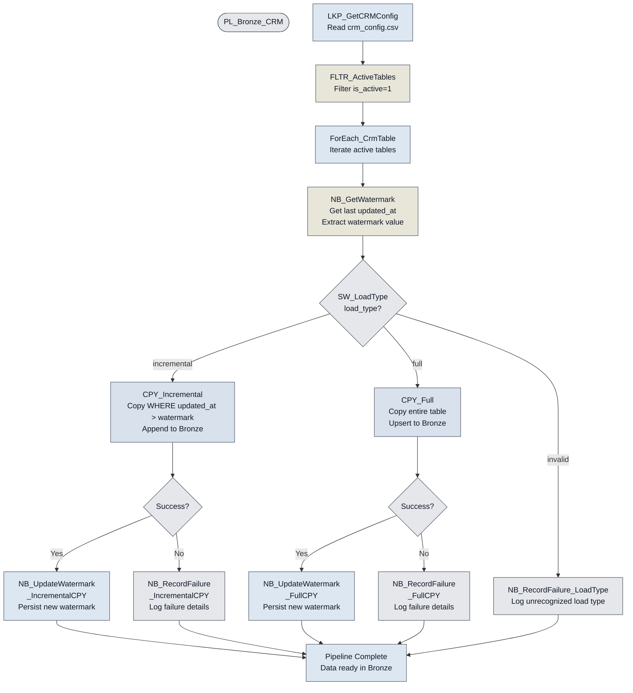
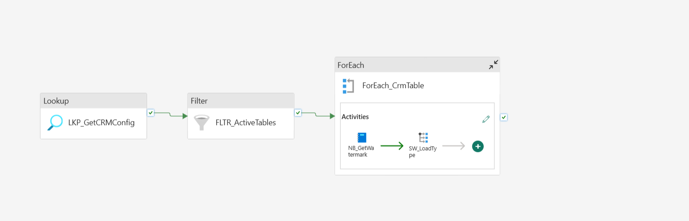
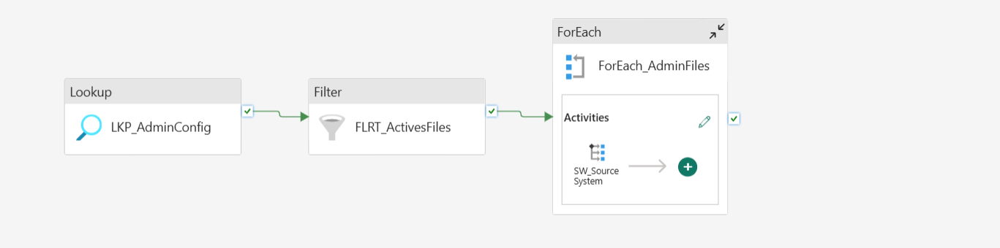
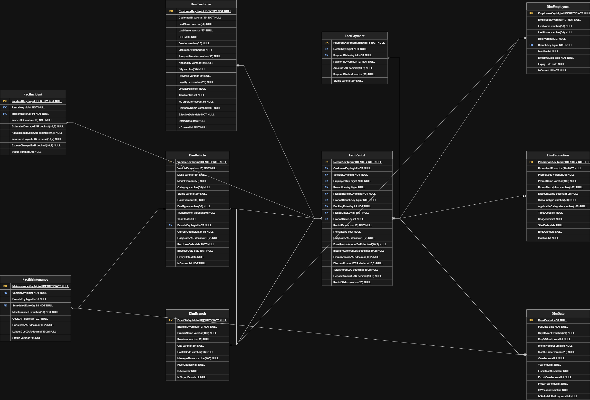

# DriveZA Holdings - Data Platform

> A Microsoft Fabric data platform that turns disconnected vehicle-rental data into governed, self-service analytics.


## Executive Summary

DriveZA Holdings is a vehicle-rental company operating across nine provinces, more than 25 cities, and 32 branches with approximately 400 vehicles. Its customer, fleet, HR, branch, and payment information is distributed across systems that do not share the same structure or update process. This project brings those sources together on Microsoft Fabric and organizes them into raw, curated, and reporting-ready layers. The result is a traceable foundation for reliable dashboards, self-service analysis, and future AI and machine-learning use cases.

## Architecture Overview

.png)

The Fabric task flow connects administration and fleet/CRM ingestion to Bronze, Silver transformation, Gold transformation, and business-facing data visualization.


Fabric Data Factory orchestrates ingestion and transformation, OneLake stores Delta data, and `WH_DRZ_GOLD` presents a dimensional model for reporting. The three layers have deliberately separate responsibilities:

| Layer | Purpose | Fabric asset |
|---|---|---|
| Bronze | Preserve raw source data and ingestion context | `LH_DRZ_BRONZE` and `DRIVEZA_FLEET` mirror |
| Silver | Clean, standardize, deduplicate, and incrementally merge data | `LH_DRZ_SILVER` |
| Gold | Serve reusable dimensions and facts for analytics | `WH_DRZ_GOLD` |

## Business Problem

- The rental platform, Bluebird Auto Rental Systems, manages bookings, customers, payments, and promotions on an on-premises SQL Server.
- Fleet operations use MiX by Powerfleet for vehicle tracking, incident logging, and maintenance scheduling. Its data lands in an Azure SQL Server managed by the fleet team.
- HR records are mastered in PaySpace and periodically exported as spreadsheets, while Branch Operations maintains branch managers and fleet capacity in a separate spreadsheet.1wssfh.0o5
- This project uses SQL Server for the CRM, Snowflake to simulate the fleet team's Azure SQL Server and demonstrate a mirrored/shared external database pattern, and GitHub-hosted CSV files to simulate the HR and branch spreadsheet exports.
- The sources use different schemas, keys, delivery mechanisms, and refresh frequencies.
- Analysts must reconcile rental, payment, customer, vehicle, branch, employee, maintenance, and incident data before producing trusted metrics.
- Without shared controls, transformation logic is duplicated across reports and the path from source to KPI is difficult to audit.

## Solution Overview

The platform integrates four source feeds into Microsoft Fabric and applies source-appropriate ingestion patterns. Bronze preserves what arrived, Silver creates consistent Delta tables, and Gold provides a warehouse star schema for reporting. Configuration tables, watermarks, schema checks, and run logs make the process reusable and observable.

## Technology Stack

| Area | Technology |
|---|---|
| Cloud platform | Microsoft Fabric |
| Orchestration | Fabric Data Factory pipelines |
| Transformation | PySpark Fabric Notebooks and SQL Stored Procedures |
| Storage | OneLake with Delta Lake tables |
| Source systems | SQL Server 2022, Snowflake, and GitHub raw files |
| Serving | Fabric Warehouse with T-SQL and Direct Lake semantic model pattern |
| Governance | Microsoft Purview catalog and governance capabilities |
| Version control | GitHub with Fabric Git integration |

## Data Sources

| Operational source | Project substitute | Data domains | Fabric integration |
|---|---|---|---|
| Bluebird Auto Rental Systems, on-premises SQL Server | SQL Server CRM source | Customers, payments, rentals, promotions, reviews | Self-hosted Integration Runtime (SHIR) |
| MiX by Powerfleet data in fleet-managed Azure SQL Server | Snowflake database, mirrored into Fabric as `DRIVEZA_FLEET` | Vehicles, maintenance, incidents | Native connection and Fabric mirror |
| Branch Operations spreadsheet | GitHub-hosted CSV | Branches, manager assignments, fleet capacity | HTTP connector; full-load pattern |
| PaySpace HR export spreadsheet | GitHub-hosted CSV | Staff and employee reference data | HTTP connector; full-load pattern |

Snowflake and GitHub are deliberate project substitutes for the production-like source patterns above. They allow the implementation to demonstrate external database mirroring and file-based ingestion.

## Medallion Architecture

### Bronze

`LH_DRZ_BRONZE` is the raw landing and observability layer. It preserves source structure while adding ingestion context for replay, reconciliation, and lineage.
For the data landing in the Bronze lakhouse `LH_DRZ_BRONZE`, two pipelines are used; the `PL_Bronze_Admin` to ingest the branches and staff files and the `PL_Bronze_CRM` to ingest CRM data.

 Fleet data is made available through the mirrored `DRIVEZA_FLEET` database for direct reference.


`DRIVEZA_FLEET` mirrored database available in the Fabric workspace for fleet data access.


Mirrored database details, including its connection and configuration information.


Bronze storage assets, including the lakehouse and mirrored database used by the ingestion layer.

#### CRM Ingestion Pipeline (`PL_Bronze_CRM`)

The CRM pipeline extracts changed records from SQL Server into the Fabric Bronze Lakehouse using a metadata-driven, watermark-based incremental loading pattern. It reads configuration details from a CSV table stored in the lakehouse files folder and uses that metadata to determine which activities to execute instead of hardcoding them for each task. This makes the process more reusable, maintainable, and easier to scale.

The CRM configuration table contains the following information:

- `source_table_name`: The source table name in SQL Server.
- `schema_name`: The source schema name. This is also used as the destination schema name in the Bronze Lakehouse.
- `destination_table_name`: The target table name in the Bronze Lakehouse.
- `load_type`: The ingestion strategy, either `incremental` or `full`.
- `default_watermark`: The baseline watermark used for the initial load. This was set to start ingestion from 1 January 2020 to comply with the agreed requirement to load only the last five years of data.
- `initial_load_column`: The column used when no prior watermark exists.
- `incremental_column`: The column used to detect new or changed rows.
- `is_active`: Indicates whether the table is enabled for processing. This allows a specific table or subset of tables to be activated while others remain inactive, avoiding unnecessary processing.


CRM configuration table that controls active status, source and destination names, load type, and watermark settings.



The `PL_Bronze_CRM` pipeline uses metadata to process CRM tables without hardcoding each source table. The first activity, `LKP_GetCRMConfig` (**Lookup** activity), reads `crm_config.csv` from the `Configurations` folder in `LH_DRZ_BRONZE`. It passes each table's source and destination names, load type, watermark settings, and `is_active` flag to the next activity. `FLTR_ActiveTables` (**Filter** activity) keeps only definitions where `is_active = 1`, preventing disabled tables from being processed. `ForEach_CrmTable` (**ForEach** activity) then iterates over the filtered configuration and runs the ingestion logic for each active table. Because the loop is configured with a batch count of one, tables are processed one at a time, which limits concurrent writes and makes operational tracing easier.
For example, if the watermark is `2026-08-01 00:00:00`, a row with `updated_at = 2026-08-02 10:30:00` is loaded because it is greater than the watermark, while a row with `updated_at = 2026-07-31 15:00:00` is skipped. After a successful load, the latest loaded `updated_at` becomes the new watermark for the next run.

For the full-load case, `CPY_Full` (**Copy** activity) reads the complete SQL Server table and upserts it into the same dynamic Bronze destination using the configured `upsert_key`. Upsert is used instead of overwrite so the load can update existing records and insert new ones while preserving the table and its history when the source is reprocessed. This makes full-load reruns safer and idempotent, and avoids the unnecessary disruption of dropping and recreating the destination table. On success, `NB_UpdateWatermark_FullCPY` (**Notebook** activity) records the successful load in `metadata.pipeline_control` and `metadata.pipeline_run_log`; on failure, `NB_RecordFailure_FullCPY` (**Notebook** activity) records the failed load and error in those same control tables. The Switch activity's default branch invokes `NB_RecordFailure_LoadType` (**Notebook** activity) to log unsupported `load_type` values instead of allowing an invalid configuration to proceed. Copy retries are configured in the pipeline, and the failure notebooks ensure that unsuccessful loads do not advance the incremental watermark, providing the traceability needed for troubleshooting and safe reruns.


The Copy activities and selected notebook activities also use retry policies to handle temporary connection or service failures. A retry can allow a load to recover without manual intervention; however, when all attempts fail, the relevant `NB_RecordFailure` notebook records the failure for investigation.


Complete `PL_Bronze_CRM` pipeline, including metadata lookup, active-table filtering, table iteration, watermark retrieval, load-type routing, and the incremental and full-load branches.


Activities inside `ForEach_CrmTable`, where each active CRM table is processed through the watermark notebook and then passed to the load-type switch.


`SW_LoadType` routing a table to the incremental Copy activity, the full-load Copy activity, or the default failure branch for an unsupported load type.


The retry mechanism: a Copy activity failed on its first attempt but succeeded on a subsequent retry. This helps the pipeline recover from transient failures without immediately recording the load as permanently failed.


Copy activity that failed after the available attempts were exhausted. The corresponding `NB_RecordFailure` notebook captured the failure details and logged them in the control and run-log tables for investigation.

**Pipeline Control**

The Bronze control table records the status and row counts for CRM loads, providing an operational view of each table's latest execution state:


The control records capture load status, row counts, watermarks, and execution details written by the CRM notebooks.
 
#### Admin File Ingestion Pipeline (`PL_Bronze_Admin`)

The Admin pipeline uses the same metadata-driven pattern as the CRM pipeline to load configured files into the Bronze lakehouse. `LKP_AdminConfig` (**Lookup** activity) reads `admin_files_config.csv`, and `FLRT_ActivesFiles` (**Filter** activity) keeps only records where `is_active = 1`. `ForEach_AdminFiles` (**ForEach** activity) processes each active file, while `SW_SourceSystem` (**Switch** activity) selects the source-specific branch. `CPY_Github_Hr` and `CPY_GitHub_Admin` (**Copy** activities) retrieve the HR and administration files from GitHub and copy them in the file section of the lakehouse, and `NB_Table_Loading_Hr` and `NB_Table_Loading_Admin` (**Notebook** activities) load them into their configured Bronze tables. This keeps file names, destinations, delimiters, and source handling in configuration rather than pipeline code.


The administration configuration defines the active files, source systems, destinations, delimiters, and load settings consumed by the pipeline.


The full Admin pipeline shows configuration lookup, active-file filtering, iteration, source-system routing, file landing, and table loading.


The `ForEach_AdminFiles` scope applies the configured file-processing steps to each active HR or administration definition.

#### Bronze Data Quality Validation

After the CRM and Admin ingestion processes complete, `NB_Bronze_DataQuality` (**TridentNotebook** activity) discovers the available CRM, Admin, and mirrored fleet tables and validates their accessibility, row counts, column counts, duplicate keys, and null keys. Each result is appended to `metadata.data_quality`, providing a consolidated record of Bronze data quality for monitoring and investigation.


### Silver

`LH_DRZ_SILVER` is the curated Delta Lake layer. The Silver transformation reads Bronze tables and the fleet mirror, then prepares stable tables for downstream modeling.


The Silver configuration table defines the business key, watermark column, and active status used to control each table's transformation.

`NB_Silver_MetaSetup` (**TridentNotebook** activity) creates the Silver metadata schema and its Delta tables, including `metadata.pipeline_control`, `metadata.pipeline_run_log`, `metadata.silver_config`, `metadata.data_quality`, and `metadata.table_maintenance`. It seeds the table configuration and value-normalization map, and creates the `metadata.data_quality_summary` materialized lake view for consolidated quality results.

Silver processing is orchestrated by `PL_Silver_Transform`, whose **TridentNotebook** activity runs `NB_Silver_Transform`. The notebook first discovers CRM and Admin tables in `LH_DRZ_BRONZE` and fleet tables in the `DRIVEZA_FLEET` mirror. It then reads the last successful watermark from `metadata.pipeline_control`, table rules from `metadata.silver_config`, and configured value corrections from `metadata.value_normalization_map`.

For each configured active table, `NB_Silver_Transform` applies the following sequence:

1. Filters the source using the configured watermark when a previous successful watermark exists; otherwise, performs the initial full read.
2. Drops technical columns and standardizes column names, trims string values, and converts configured null tokens to `NULL`.
3. Normalizes phone-number fields and applies configuration-driven value corrections, such as country-name fixes.
4. Validates that the configured business keys and watermark column exist, removes records with null business keys, and deduplicates records with a window ordered by the watermark column.
5. Adds `silver_load_timestamp`, `record_created_at`, and `record_updated_at`, then calculates an `xxhash64` `record_hash` for change detection.
6. Creates the Silver schema and table when needed. Existing tables are updated with Delta `MERGE`: rows with matching business keys are updated only when their hash changes, while new keys are inserted. Empty incremental batches skip the write.
7. Writes per-table metrics to `metadata.pipeline_control` and appends execution details, including rows read, rows written, inserts, updates, errors, and duration, to `metadata.pipeline_run_log`. Missing configuration, inactive tables, and processing errors are isolated per table and logged without stopping the remaining tables; configured failure alerts are available but disabled by default.


The Silver lakehouse contains the curated tables produced from CRM, administration, and fleet sources.


The Silver pipeline run log shows the result of the transformation, including table-level status, row counts, watermarks, and execution duration.

`PL_SolverBronze_QualityCheck` runs `NB_Bronze_QualityCheck` and, after it succeeds, `NB_Silver_QualityCheck` as **TridentNotebook** activities. Together they validate source and Silver table accessibility, row and column counts, duplicate keys, and null keys, appending the results to `metadata.data_quality`.

`PL_SilverBronze_Optimizer` runs `NB_SilverBronze_Optimiser` as a **TridentNotebook** activity. The optimizer records maintenance results in `LH_DRZ_SILVER.metadata.table_maintenance`, skips mirrored tables because their storage is managed by Fabric mirroring, and skips tables below the configured file-count threshold. Eligible Delta tables receive `OPTIMIZE`, optionally with configured `ZORDER`, followed by `VACUUM` using the default seven-day retention unless an approved table-specific override exists.

### Gold

`WH_DRZ_GOLD` is the reporting and analytics layer. Warehouse stored procedures load a star schema from Silver, separating reusable dimensions from measurable business events.

The Gold pipeline coordinates the final warehouse transformations and prepares the reporting-ready model:


The model contains six dimensions: `DimDate`, `DimCustomer`, `DimBranch`, `DimVehicle`, `DimEmployees`, and `DimPromotion`. It contains four facts: `FactRental`, `FactPayment`, `FactMaintenance`, and `FactIncident`. Customer history uses current-record tracking with effective and expiry dates, providing stable relationships for operational and commercial KPIs.

## Key Engineering Features

- **Incremental watermark loading:** Source `updated_at` values limit CRM extraction to changed records and persist repeatable pipeline state.
- **Metadata-driven processing:** Watermark, control, run-log, and Silver configuration tables centralize business keys, active flags, execution state, and transformation behavior.
- **Schema evolution:** Incoming structures are compared with existing Bronze schemas, with compatible additions recorded before transformation continues.
- **Delta Lake patterns:** Silver uses durable Delta tables for transactional writes, schema management, change detection, and replayable processing.
- **Merge and upsert logic:** Business keys and record hashes distinguish inserts, updates, and unchanged records while avoiding unnecessary rewrites.
- **Data quality checks:** Dedicated notebooks validate expected tables, row counts, null patterns, schema changes, and load outcomes.
- **Operational observability:** Pipeline run logs and failure records make each load traceable from orchestration through table-level processing.
- **Dimensional modeling:** Gold provides conformed dimensions and facts, including effective and expiry dates for changing customer attributes.

## Data Model



The Gold model is a rental-operations star schema. `FactRental` is the central business event and connects reporting activity to customer, vehicle, branch, employee, promotion, and date dimensions. Payment, maintenance, and incident facts provide additional financial and operational views.

## Governance

### Built

- Bronze, Silver, and Gold boundaries separate raw, curated, and reporting data.
- Source metadata, pipeline control, run logs, failure records, and schema-change logs support traceability.
- Business keys and transformation rules are managed through configuration tables.
- Lakehouse and warehouse assets provide distinct processing and consumption boundaries.
- Git integration enables version control and CI/CD collaboration:


### Planned or Service-Managed

- Microsoft Purview catalog registration and automated lineage across Fabric assets.
- Classification and sensitivity labels for customer and employee data.
- Least-privilege workspace and item access policies.
- Certified semantic model, Fabric Data Agent, and Microsoft 365 Copilot configuration.

Purview, Power BI, Data Agent, and Copilot settings are service-level configurations and are not stored as repository files.

## Results / Metrics

The implemented scope provides the following measurable coverage:

| Metric | Current scope |
|---|---:|
| Integrated source feeds | 4 |
| Medallion layers | 3 |
| Gold dimensions | 6 |
| Gold fact tables | 4 |
| Gold tables | 10 |
| Loading patterns | Incremental and full-load |

The business result is one traceable path from disconnected operational systems to reusable analytics. The platform is designed to scale by adding metadata and source-specific configuration instead of duplicating an entire pipeline for every table.

## Lessons Learned / Design Decisions

- **Fabric as the platform:** A single environment covers orchestration, notebooks, OneLake, lakehouse processing, warehouse serving, and semantic-model foundations.
- **Three layers:** Separating raw preservation, curation, and presentation limits coupling and makes failures easier to isolate.
- **Metadata over duplication:** Watermarks, business keys, and control state vary by source and table, so configuration is more maintainable than bespoke pipelines.
- **Warehouse for Gold:** A relational star schema gives reporting users predictable joins and stable business entities after flexible lakehouse processing.
- **Source-specific ingestion:** SQL Server, Snowflake, and file feeds have different delivery and change patterns; applying one universal strategy would reduce reliability.

## Limitations & Future Improvements

- Source systems and data are synthetic; production use would require real connections, credentials, networking, and operational SLAs.
- Purview policies, sensitivity labels, access groups, Power BI reports, Data Agent, and Copilot settings are service-managed rather than stored here.
- Automated unit, integration, and data-reconciliation tests should be added around each source and layer.
- Future improvements include CI/CD validation, richer quality thresholds, SLA monitoring, late-arriving fact handling, and incremental refresh optimization.
- The curated model provides a foundation for forecasting, anomaly detection, and other governed AI/ML workloads.

## How to Explore This Repo

1. Start with the architecture diagram and Gold ERD in `architecture/`.
2. Review Bronze notebooks and pipelines for ingestion, watermarks, quality checks, and failure handling.
3. Read `Fabric/Silver/Notebooks/NB_Silver_Transformation.Notebook/notebook-content.py` for standardization, deduplication, and merge behavior.
4. Inspect Gold table DDL and stored procedures under `Fabric/Gold/Storage/WH_DRZ_GOLD.Warehouse/`.
5. Review the SQL Server and Snowflake DDL and loaders under `src/`.
6. Read the supporting design notes in `docs/`.

## Repository Structure

```
DriveZA-Holdings/
├── README.md
├── architecture/
│   ├── Architecture Diagram.png
│   ├── DriveZa Architecture.png
│   ├── DriveZa Architecture.drawio.svg
│   └── data-model-erd.svg
├── docs/
│   ├── data-sources.md
│   ├── metadata-framework.md
│   ├── governance.md
│   ├── design-decisions.md
│   └── limitations.md
├── data/
│   ├── README.md
│   └── raw-landing/admin/
│       ├── crm_branches.csv
│       └── hr_staff.csv
├── screenshots/
│   ├── Bronze Config table.png
│   ├── Bronze Lakehouse.png
│   ├── Bronze Storage.png
│   ├── crm config table.png
│   ├── DriveZa Task FLow.png
│   ├── gold pipeline.png
│   ├── Pipeline Control.png
│   ├── PL_Bronze_Admin.png
│   ├── PL_Bronze_Admin(Inside ForEach).png
│   ├── PL_Bronze_CRM.png
│   ├── PL_Bronze_CRM(Inside For Each).png
│   └── PL_Bronze_CRM(Inside Switch).png
├── Fabric/
│   ├── Bronze/
│   │   ├── Notebooks/
│   │   ├── Pipelines/
│   │   └── Strorage/
│   ├── Silver/
│   │   ├── Notebooks/
│   │   ├── Pipelines/
│   │   └── Storage/
│   └── Gold/
│       ├── Notebooks/
│       ├── Pipelines/
│       └── Storage/
└── src/
    ├── snowflake/
    │   ├── ddl/
    │   └── loaders/
    └── sql_server/
        ├── ddl/
        └── loaders/
```

## Key Achievements

- End-to-end Microsoft Fabric implementation using Bronze, Silver, and Gold layers.
- Metadata-driven ingestion and transformation framework with operational logging.
- Multi-source integration across SQL Server, Snowflake, and GitHub-hosted files.
- Complementary Lakehouse and Warehouse architecture for engineering and reporting.
- Dimensional model foundation for semantic models and Power BI reporting.
- Governance-ready design with lineage, classification, sensitivity-label, and access-control pathways.
- Clear route to governed natural-language analytics through Fabric Data Agent and Microsoft 365 Copilot.

## Contact / Links

- **Author:** Pacifique Nteta
- **GitHub:** [DriveZA-Holdings](https://github.com/PacifiqueNteta/DriveZA-Holdings)
- **LinkedIn:** [Pacifique Nteta](https://www.linkedin.com/in/pacifique-nteta)
