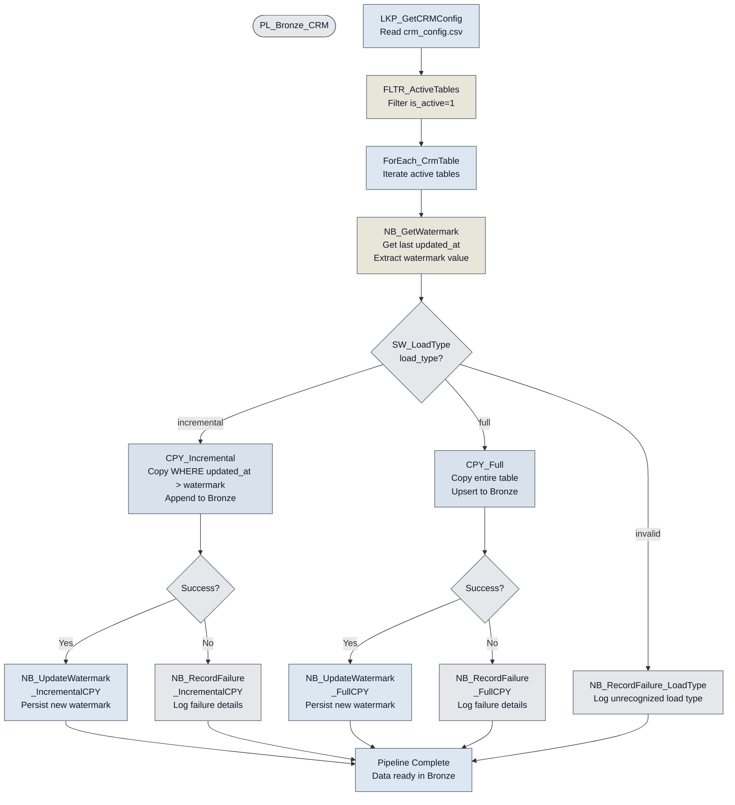
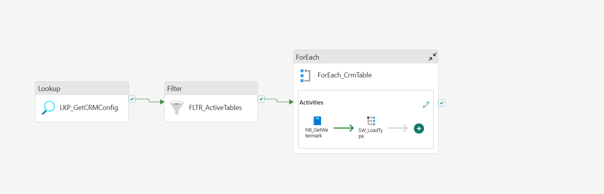
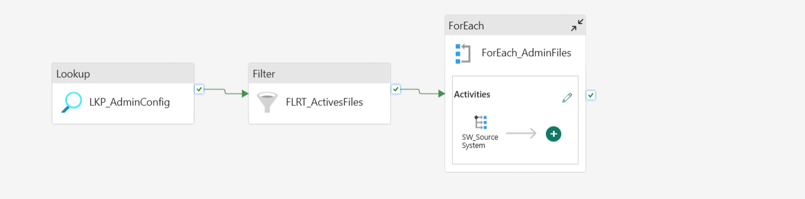
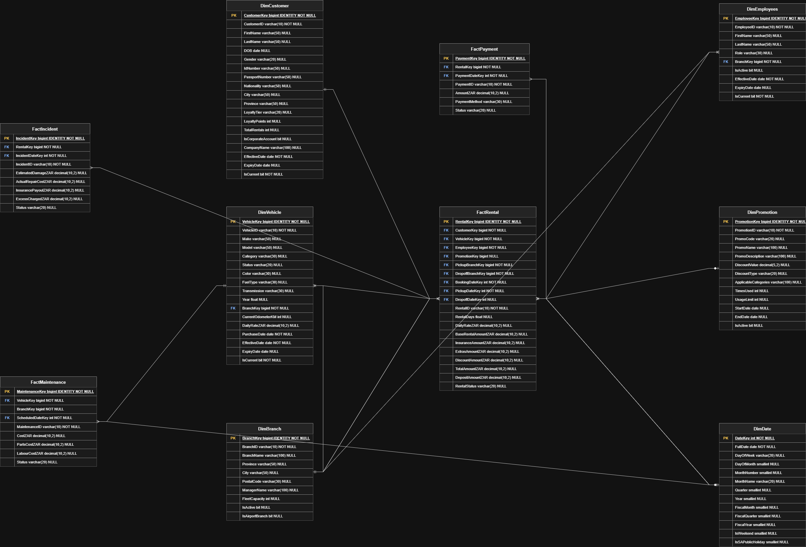
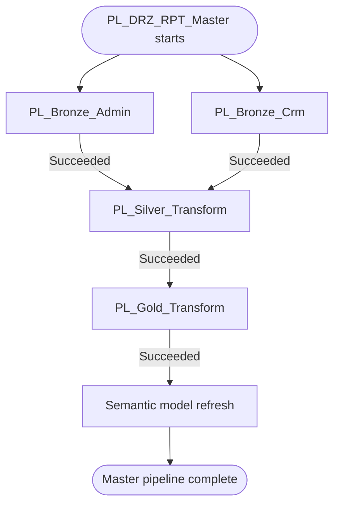

# DriveZA Holdings - Data Platform

> A Microsoft Fabric data platform that turns disconnected vehicle-rental data into governed, self-service analytics.


## Executive Summary

DriveZA Holdings is a vehicle-rental company operating across nine provinces, more than 25 cities, and 32 branches with approximately 400 vehicles. Its customer, fleet, HR, branch, and payment information is distributed across systems that do not share the same structure or update process. This project brings those sources together on Microsoft Fabric and organizes them into raw, curated, and reporting-ready layers. The result is a traceable foundation for reliable dashboards, self-service analysis, and future AI and machine-learning use cases.

## Architecture Overview

.png)

The Fabric task flow connects administration and fleet/CRM ingestion to Bronze, Silver transformation, Gold transformation, and business-facing data visualization.


Fabric Data Factory orchestrates ingestion and transformation, OneLake stores Delta data, and `WH_DRZ_GOLD` presents a dimensional model for reporting. The three layers have deliberately separate responsibilities:

| Layer | Purpose | Fabric asset |
|---|---|---|
| Bronze | Preserve raw source data and ingestion context | `LH_DRZ_BRONZE` and `DRIVEZA_FLEET` mirror |
| Silver | Clean, standardize, deduplicate, and incrementally merge data | `LH_DRZ_SILVER` |
| Gold | Serve reusable dimensions and facts for analytics | `WH_DRZ_GOLD` |

## Business Problem

- The rental platform, Bluebird Auto Rental Systems, manages bookings, customers, payments, and promotions on an on-premises SQL Server.
- Fleet operations use MiX by Powerfleet for vehicle tracking, incident logging, and maintenance scheduling. Its data lands in an Azure SQL Server managed by the fleet team.
- HR records are mastered in PaySpace and periodically exported as spreadsheets, while Branch Operations maintains branch managers and fleet capacity in a separate spreadsheet.
- This project uses SQL Server for the CRM, Snowflake to simulate the fleet team's Azure SQL Server and demonstrate a mirrored/shared external database pattern, and GitHub-hosted CSV files to simulate the HR and branch spreadsheet exports.
- The sources use different schemas, keys, delivery mechanisms, and refresh frequencies.
- Analysts must reconcile rental, payment, customer, vehicle, branch, employee, maintenance, and incident data before producing trusted metrics.
- Without shared controls, transformation logic is duplicated across reports and the path from source to KPI is difficult to audit.

## Solution Overview

The platform integrates four source feeds into Microsoft Fabric and applies source-appropriate ingestion patterns. Bronze preserves what arrived, Silver creates consistent Delta tables, and Gold provides a warehouse star schema for reporting. Configuration tables, watermarks, schema checks, and run logs make the process reusable and observable.

## Technology Stack

| Area | Technology |
|---|---|
| Cloud platform | Microsoft Fabric |
| Orchestration | Fabric Data Factory pipelines |
| Transformation | PySpark Fabric Notebooks and SQL Stored Procedures |
| Storage | OneLake with Delta Lake tables |
| Source systems | SQL Server 2022, Snowflake, and GitHub raw files |
| Serving | Fabric Warehouse with T-SQL and Direct Lake semantic model pattern |
| Governance | Microsoft Purview catalog and governance capabilities |
| Version control | GitHub with Fabric Git integration |

## Data Sources

| Operational source | Project substitute | Data domains | Fabric integration |
|---|---|---|---|
| Bluebird Auto Rental Systems, on-premises SQL Server | SQL Server CRM source | Customers, payments, rentals, promotions, reviews | Self-hosted Integration Runtime (SHIR) |
| MiX by Powerfleet data in fleet-managed Azure SQL Server | Snowflake database, mirrored into Fabric as `DRIVEZA_FLEET` | Vehicles, maintenance, incidents | Native connection and Fabric mirror |
| Branch Operations spreadsheet | GitHub-hosted CSV | Branches, manager assignments, fleet capacity | HTTP connector; full-load pattern |
| PaySpace HR export spreadsheet | GitHub-hosted CSV | Staff and employee reference data | HTTP connector; full-load pattern |

Snowflake and GitHub are deliberate project substitutes for the production-like source patterns above. They allow the implementation to demonstrate external database mirroring and file-based ingestion.

## Medallion Architecture

### Bronze

`LH_DRZ_BRONZE` is the raw landing and observability layer. It preserves source structure while adding ingestion context for replay, reconciliation, and lineage.
Two pipelines load data into the Bronze lakehouse `LH_DRZ_BRONZE`: `PL_Bronze_Admin` ingests the branch and staff files, while `PL_Bronze_CRM` ingests CRM data.

Fleet data is made available through the mirrored `DRIVEZA_FLEET` database for direct reference.


`DRIVEZA_FLEET` mirrored database available in the Fabric workspace for fleet data access.


Mirrored database details, including its connection and configuration information.


Bronze storage assets, including the lakehouse and mirrored database used by the ingestion layer.

Before pipeline execution begins, the `NB_Bronze_Meta_Setup` notebook is run once to create the foundational `metadata` schema and the Bronze control tables used throughout ingestion and monitoring. This setup establishes the operational metadata layer for tracking source status, execution logs, and data-quality checks. The key objects created include `metadata.pipeline_control`, `metadata.pipeline_run_log`, and `metadata.data_quality`, along with the supporting view used for summarised quality reporting. This ensures each ingestion run has a consistent place to store watermarks, run outcomes, row counts, and operational diagnostics.

#### CRM Ingestion Pipeline (`PL_Bronze_CRM`)

The CRM pipeline extracts changed records from SQL Server into the Fabric Bronze Lakehouse using a metadata-driven, watermark-based incremental loading pattern. It reads configuration details from a CSV table stored in the lakehouse files folder and uses that metadata to determine which activities to execute instead of hardcoding them for each task. This makes the process more reusable, maintainable, and easier to scale.

The CRM configuration table contains the following information:

- `source_table_name`: The source table name in SQL Server.
- `schema_name`: The source schema name. This is also used as the destination schema name in the Bronze Lakehouse.
- `destination_table_name`: The target table name in the Bronze Lakehouse.
- `load_type`: The ingestion strategy, either `incremental` or `full`.
- `default_watermark`: The baseline watermark used for the initial load. This was set to start ingestion from 1 January 2020 to comply with the agreed requirement to load only the last five years of data.
- `initial_load_column`: The column used when no prior watermark exists.
- `incremental_column`: The column used to detect new or changed rows.
- `is_active`: Indicates whether the table is enabled for processing. This allows a specific table or subset of tables to be activated while others remain inactive, avoiding unnecessary processing.


CRM configuration table that controls active status, source and destination names, load type, and watermark settings.


```mermaid
flowchart TD
    Title(["PL_Bronze_CRM"])
    LKP["LKP_GetCRMConfig<br/>Read crm_config.csv"]
    FLTR["FLTR_ActiveTables<br/>Filter is_active=1"]
    ForEach["ForEach_CrmTable<br/>Iterate active tables"]
    GetWM["NB_GetWatermark<br/>Get last updated_at<br/>Extract watermark value"]
    Switch{SW_LoadType<br/>load_type?}
    CPYIncr["CPY_Incremental<br/>Copy WHERE updated_at > watermark<br/>Append to Bronze"]
    CPYFull["CPY_Full<br/>Copy entire table<br/>Upsert to Bronze"]
    RecordInvalid["NB_RecordFailure_LoadType<br/>Log unrecognized load type"]
    SuccessIncr{Success?}
    SuccessFull{Success?}
    UpdateWMIncr["NB_UpdateWatermark<br/>_IncrementalCPY<br/>Persist new watermark"]
    FailIncr["NB_RecordFailure<br/>_IncrementalCPY<br/>Log failure details"]
    UpdateWMFull["NB_UpdateWatermark<br/>_FullCPY<br/>Persist new watermark"]
    FailFull["NB_RecordFailure<br/>_FullCPY<br/>Log failure details"]
    Complete["Pipeline Complete<br/>Data ready in Bronze"]

    LKP --> FLTR
    FLTR --> ForEach
    ForEach --> GetWM
    GetWM --> Switch

    Switch -->|incremental| CPYIncr
    Switch -->|full| CPYFull
    Switch -->|invalid| RecordInvalid

    CPYIncr --> SuccessIncr
    CPYFull --> SuccessFull

    SuccessIncr -->|Yes| UpdateWMIncr
    SuccessIncr -->|No| FailIncr

    SuccessFull -->|Yes| UpdateWMFull
    SuccessFull -->|No| FailFull

    UpdateWMIncr --> Complete
    FailIncr --> Complete
    UpdateWMFull --> Complete
    FailFull --> Complete
    RecordInvalid --> Complete

    style Title fill:#E5E7EB,stroke:#4B5563,stroke-width:1px,color:#111827
    style LKP fill:#DDE7F2,stroke:#4B5563,stroke-width:1px,color:#111827
    style FLTR fill:#E8E6D9,stroke:#4B5563,stroke-width:1px,color:#111827
    style ForEach fill:#DDE7F2,stroke:#4B5563,stroke-width:1px,color:#111827
    style GetWM fill:#E8E6D9,stroke:#4B5563,stroke-width:1px,color:#111827
    style Switch fill:#E5E7EB,stroke:#4B5563,stroke-width:1px,color:#111827
    style CPYIncr fill:#D9E2EC,stroke:#4B5563,stroke-width:1px,color:#111827
    style CPYFull fill:#D9E2EC,stroke:#4B5563,stroke-width:1px,color:#111827
    style RecordInvalid fill:#E5E7EB,stroke:#4B5563,stroke-width:1px,color:#111827
    style SuccessIncr fill:#E5E7EB,stroke:#4B5563,stroke-width:1px,color:#111827
    style SuccessFull fill:#E5E7EB,stroke:#4B5563,stroke-width:1px,color:#111827
    style UpdateWMIncr fill:#DDE7F2,stroke:#4B5563,stroke-width:1px,color:#111827
    style FailIncr fill:#E5E7EB,stroke:#4B5563,stroke-width:1px,color:#111827
    style UpdateWMFull fill:#DDE7F2,stroke:#4B5563,stroke-width:1px,color:#111827
    style FailFull fill:#E5E7EB,stroke:#4B5563,stroke-width:1px,color:#111827
    style Complete fill:#DDE7F2,stroke:#4B5563,stroke-width:1px,color:#111827
```

The `PL_Bronze_CRM` pipeline uses metadata to process CRM tables without hardcoding each source table. The first activity, `LKP_GetCRMConfig` (**Lookup** activity), reads `crm_config.csv` from the `Configurations` folder in `LH_DRZ_BRONZE`. It passes each table's source and destination names, load type, watermark settings, and `is_active` flag to the next activity. `FLTR_ActiveTables` (**Filter** activity) keeps only definitions where `is_active = 1`, preventing disabled tables from being processed. `ForEach_CrmTable` (**ForEach** activity) then iterates over the filtered configuration and runs the ingestion logic for each active table. Because the loop is configured with a batch count of one, tables are processed one at a time, which limits concurrent writes and makes operational tracing easier.
For example, if the watermark is `2026-08-01 00:00:00`, a row with `updated_at = 2026-08-02 10:30:00` is loaded because it is greater than the watermark, while a row with `updated_at = 2026-07-31 15:00:00` is skipped. After a successful load, the latest loaded `updated_at` becomes the new watermark for the next run.

For the full-load case, `CPY_Full` (**Copy** activity) reads the complete SQL Server table and upserts it into the same dynamic Bronze destination using the configured `upsert_key`. Upsert is used instead of overwrite so the load can update existing records and insert new ones while preserving the table and its history when the source is reprocessed. This makes full-load reruns safer and idempotent, and avoids the unnecessary disruption of dropping and recreating the destination table. On success, `NB_UpdateWatermark_FullCPY` (**Notebook** activity) records the successful load in `metadata.pipeline_control` and `metadata.pipeline_run_log`; on failure, `NB_RecordFailure_FullCPY` (**Notebook** activity) records the failed load and error in those same control tables. The Switch activity's default branch invokes `NB_RecordFailure_LoadType` (**Notebook** activity) to log unsupported `load_type` values instead of allowing an invalid configuration to proceed. Copy retries are configured in the pipeline, and the failure notebooks ensure that unsuccessful loads do not advance the incremental watermark, providing the traceability needed for troubleshooting and safe reruns.


The Copy activities and selected notebook activities also use retry policies to handle temporary connection or service failures. A retry can allow a load to recover without manual intervention; however, when all attempts fail, the relevant `NB_RecordFailure` notebook records the failure for investigation.


Complete `PL_Bronze_CRM` pipeline, including metadata lookup, active-table filtering, table iteration, watermark retrieval, load-type routing, and the incremental and full-load branches.


Activities inside `ForEach_CrmTable`, where each active CRM table is processed through the watermark notebook and then passed to the load-type switch.


`SW_LoadType` routing a table to the incremental Copy activity, the full-load Copy activity, or the default failure branch for an unsupported load type.


The retry mechanism: a Copy activity failed on its first attempt but succeeded on a subsequent retry. This helps the pipeline recover from transient failures without immediately recording the load as permanently failed.


Copy activity that failed after the available attempts were exhausted. The corresponding `NB_RecordFailure` notebook captured the failure details and logged them in the control and run-log tables for investigation.

**Pipeline Control**

The Bronze control table records the status and row counts for CRM loads, providing an operational view of each table's latest execution state:


The control records capture load status, row counts, watermarks, and execution details written by the CRM notebooks.
 
#### Admin File Ingestion Pipeline (`PL_Bronze_Admin`)

The Admin pipeline uses the same metadata-driven pattern as the CRM pipeline to load configured files into the Bronze lakehouse. `LKP_AdminConfig` (**Lookup** activity) reads `admin_files_config.csv`, and `FLRT_ActivesFiles` (**Filter** activity) keeps only records where `is_active = 1`. `ForEach_AdminFiles` (**ForEach** activity) processes each active file, while `SW_SourceSystem` (**Switch** activity) selects the source-specific branch. `CPY_Github_Hr` and `CPY_GitHub_Admin` (**Copy** activities) retrieve the HR and administration files from GitHub and copy them into the lakehouse Files section, while `NB_Table_Loading_Hr` and `NB_Table_Loading_Admin` (**Notebook** activities) load them into their configured Bronze tables. This keeps file names, destinations, delimiters, and source handling in configuration rather than pipeline code.


The administration configuration defines the active files, source systems, destinations, delimiters, and load settings consumed by the pipeline.


The full Admin pipeline shows configuration lookup, active-file filtering, iteration, source-system routing, file landing, and table loading.


The `ForEach_AdminFiles` scope applies the configured file-processing steps to each active HR or administration definition.

#### Bronze Data Quality Validation

After the CRM and Admin ingestion processes complete, `NB_Bronze_DataQuality` (**TridentNotebook** activity) discovers the available CRM, Admin, and mirrored fleet tables and validates their accessibility, row counts, column counts, duplicate keys, and null keys. Each result is appended to `metadata.data_quality`, providing a consolidated record of Bronze data quality for monitoring and investigation.


### Silver

`LH_DRZ_SILVER` is the curated Delta Lake layer. The Silver transformation reads Bronze tables and the fleet mirror, then prepares stable tables for downstream modeling.


The Silver configuration table defines the business key, watermark column, and active status used to control each table's transformation.

`NB_Silver_MetaSetup` (**Notebook** activity) creates the Silver metadata schema and its Delta tables, including `metadata.pipeline_control`, `metadata.pipeline_run_log`, `metadata.silver_config`, `metadata.data_quality`, and `metadata.table_maintenance`. It seeds the table configuration and value-normalization map, and creates the `metadata.data_quality_summary` materialized lake view for consolidated quality results. This is a one-time activity.

Silver processing is orchestrated by `PL_Silver_Transform`, whose **Notebook** activity runs `NB_Silver_Transform`. The notebook first discovers CRM and Admin tables in `LH_DRZ_BRONZE` and fleet tables in the `DRIVEZA_FLEET` mirror. It then reads the last successful watermark from `metadata.pipeline_control`, table rules from `metadata.silver_config`, and configured value corrections from `metadata.value_normalization_map`.

For each configured active table, `NB_Silver_Transform` applies the following sequence:

1. Filters the source using the configured watermark when a previous successful watermark exists; otherwise, performs the initial full read.
2. Drops technical columns and standardizes column names, trims string values, and converts configured null tokens to `NULL`.
3. Normalizes phone-number values and applies configuration-driven value corrections, such as country-name fixes. While reviewing CRM customer data in Fabric, the `customers.country` field was found to contain inconsistent values such as `Germa` instead of `Germany` and `French` instead of `France`, even though `customers.nationality` already contained the correct values. This issue was traced back to source data entry errors and handled through a value-normalization lookup table. During this step, each invalid value is matched against the normalization map and replaced with the approved standard before the row is written to the Silver layer. Any future data-quality issue discovered in source is documented and added to the normalization map so the fix is consistently applied during Silver transformations.

.png)
The source CRM `customers.country` field included inconsistent values such as `Germa` and `French`, which were identified before the Silver correction step.

.png)
The distinct values from the source `customers.country` field revealed the data-quality issue and confirmed the need for a controlled normalization map.

.png)
The source `customers.nationality` field provided the trusted reference values that were used to standardize the incorrect country entries.

4. Validates that the configured business keys and watermark column exist, removes records with null business keys, and deduplicates records with a window ordered by the watermark column.
5. Adds `silver_load_timestamp`, `record_created_at`, and `record_updated_at`, then calculates an `xxhash64` `record_hash` for change detection.
6. Creates the Silver schema and table when needed. Existing tables are updated with Delta `MERGE`: rows with matching business keys are updated only when their hash changes, while new keys are inserted. Empty incremental batches skip the write.
7. Writes per-table metrics to `metadata.pipeline_control` and appends execution details, including rows read, rows written, inserts, updates, errors, and duration, to `metadata.pipeline_run_log`. Missing configuration, inactive tables, and processing errors are isolated per table and logged without stopping the remaining tables; configured failure alerts are available but disabled by default.


The Silver lakehouse after silver transform containing the curated tables produced from CRM, administration, and fleet sources.


The Silver pipeline run log showing the result of the transformation, including table-level status, row counts, watermarks, and execution duration.

#### Quality Check and Table Optimization Pipelines

Once the Silver layer has been populated, a dedicated quality pipeline, `PL_SolverBronze_QualityCheck`, can be run to validate the quality of the incoming and curated data. `PL_SolverBronze_QualityCheck` executes `NB_Bronze_QualityCheck` first and then `NB_Silver_QualityCheck`. Together, these notebooks verify source and Silver table accessibility, row and column counts, duplicate keys, and null-key patterns, and append the results to `metadata.data_quality`.

For maintenance and storage optimization, the `PL_SilverBronze_Optimizer` pipeline can also be run independently. It executes `NB_SilverBronze_Optimiser`, which records optimization results in `LH_DRZ_SILVER.metadata.table_maintenance`, skips mirrored tables because their storage is managed by Fabric mirroring, and ignores tables below the configured file-count threshold. Eligible Delta tables receive `OPTIMIZE`, optionally with configured `ZORDER`, and then `VACUUM` using the default seven-day retention unless a table-specific override has been approved.

### Gold

The Gold layer contains the warehouse `WH_DRZ_GOLD` and the semantic model `DRZ_Reporting`, which are used to prepare the reporting-ready analytics layer. The design follows a star-schema pattern optimized for self-service reporting and analytical consumption. Warehouse stored procedures read from Silver and build the dimension and fact tables that power the reporting layer.

Before the Gold warehouse load runs, `PL_Gold_DimDate` creates and loads the `DimDate` table. This date dimension is generated through the `NB_DateTable_Generation` notebook and includes attributes such as `FiscalYear`, `IsWeekend`, and `IsSAPublicHoliday`, which are essential for time-based analysis and operational insight. The date range starts on `2018-01-01` and ends on `2035-12-31`, and the resulting table is loaded into the Reporting schema in the Gold warehouse.

The Gold pipeline `PL_Gold_Transformation` orchestrates the final warehouse transformations by creating the dimensions and fact tables and establishing the relationships between them using surrogate keys rather than the source business keys. This approach preserves stable keys for reporting while supporting incremental loads and maintaining a cleaner analytical model. The warehouse contains six dimensions: `DimDate`, `DimCustomer`, `DimBranch`, `DimVehicle`, `DimEmployees`, and `DimPromotion`, and four facts: `FactRental`, `FactPayment`, `FactMaintenance`, and `FactIncident`. Customer history is tracked with effective and expiry dates to support accurate current-state reporting and historical analysis.

Surrogate keys are used in the Gold warehouse instead of the original source business keys because the business keys can change over time, may not be unique across historical versions, and may not be ideal for stable reporting joins. For example, a customer or vehicle may have a natural key that changes, the same business record may appear with different source values across updates, or some source entities are not guaranteed to be unique in every operational context. A surrogate key gives each dimension row a single internal identity that remains consistent for reporting, supports slowly changing dimensions, and avoids exposing unstable operational identifiers in the star schema. This makes joins simpler, improves relationship integrity across fact and dimension tables, and allows the warehouse to manage historical changes without corrupting the reporting model.


The Gold transformation pipeline orchestrates the warehouse build by executing the stored procedures that load the reporting dimensions and facts and prepare the final analytical model.

### Data Model


The Gold model follows a rental-operations star schema. `FactRental` is the central business event and connects reporting activity to customer, vehicle, branch, employee, promotion, and date dimensions. The supporting fact tables for payments, maintenance, and incidents provide additional operational and financial views for analysis.

### Semantic model

To prepare for reporting, a semantic model is created with the relationships between the Gold tables and the measures needed for dashboards and analysis. The model is designed to expose a straightforward analytical layer that business users can query without needing to understand the underlying raw and curated data structures.


The semantic model in Fabric maps the Gold warehouse tables into a reporting-friendly model, establishing relationships between facts and dimensions and exposing the structured analytics layer used by the reporting experience.

#### Master Pipeline


The full medallion workflow is orchestrated through a master pipeline that invokes Bronze ingestion, Silver transformation, Gold transformation, and the semantic model refresh. This pipeline is scheduled daily at 4:00 AM so the reporting layer is ready when business users begin their day. The schedule is paired with a failure alert that notifies the engineer when a run fails and includes the diagnostic details needed to investigate the issue.



```mermaid
flowchart TD
    Start([PL_DRZ_RPT_Master starts])
    BronzeAdmin[PL_Bronze_Admin]
    BronzeCRM[PL_Bronze_Crm]
    Silver[PL_Silver_Transform]
    Gold[PL_Gold_Transform]
    Semantic[Semantic model refresh]
    End([Master pipeline complete])

    Start --> BronzeAdmin
    Start --> BronzeCRM
    BronzeAdmin -->|Succeeded| Silver
    BronzeCRM -->|Succeeded| Silver
    Silver -->|Succeeded| Gold
    Gold -->|Succeeded| Semantic
    Semantic --> End
```


The master pipeline starts the Admin and CRM Bronze pipelines in parallel. `PL_Silver_Transform` begins only after both Bronze pipelines succeed, followed by `PL_Gold_Transform` and the transactional semantic model refresh. This dependency chain ensures that reporting is refreshed only after the source data has been ingested and the curated and warehouse layers have completed successfully.


The failure alert provides an early warning when the master pipeline does not complete successfully and includes diagnostic details to support troubleshooting.

.png)


The detailed failure alert gives the engineer the specific pipeline and run information needed to investigate the cause and resolve the issue quickly.

> **Screenshot note:** The pipeline is currently named `PL_DRZ_RPT_Master`. The screenshots show its former name, `PL_DRZ_MRKT_Master`, because they were captured before the pipeline was renamed.

## Governance

### Built

- Operational metadata tables record watermarks, pipeline status, row counts, failures, data-quality results, and schema changes for traceability.
- Configuration tables centralize source mappings, active-table settings, business keys, watermarks, and approved value-normalization rules.
- Git integration supports version control, CI/CD, and controlled promotion across three Fabric workspaces: `dev` for development, `test` for validation, and `prod` for the live reporting environment.

The three-workspace setup separates authoring from validation and production consumption. The `dev` workspace uses one month of data for fast development and iteration, while `test` uses six months of data to evaluate the solution across a broader and more representative period. After validation, the solution is promoted to `prod`, where it processes the full available dataset for live reporting. This promotion path reduces the risk of untested pipeline, notebook, lakehouse, warehouse, and semantic-model changes reaching the live reporting environment.


## Results / Metrics

The implemented scope provides the following measurable coverage:

| Metric | Current scope |
|---|---:|
| Integrated source feeds | 4 |
| Medallion layers | 3 |
| Gold dimensions | 6 |
| Gold fact tables | 4 |
| Gold tables | 10 |
| Loading patterns | Incremental and full-load |

The business result is one traceable path from disconnected operational systems to reusable analytics. The platform is designed to scale by adding metadata and source-specific configuration instead of duplicating an entire pipeline for every table.

## Lessons Learned / Design Decisions

- **Fabric as the platform:** A single environment covers orchestration, notebooks, OneLake, lakehouse processing, warehouse serving, and semantic-model foundations.
- **Three layers:** Separating raw preservation, curation, and presentation limits coupling and makes failures easier to isolate.
- **Metadata over duplication:** Watermarks, business keys, and control state vary by source and table, so configuration is more maintainable than bespoke pipelines.
- **Warehouse for Gold:** A relational star schema gives reporting users predictable joins and stable business entities after flexible lakehouse processing.
- **Source-specific ingestion:** SQL Server, Snowflake, and file feeds have different delivery and change patterns; applying one universal strategy would reduce reliability.

## Limitations & Future Improvements

- **CSV configuration is suitable for a small proof of concept but not ideal for production control.** In Bronze, the pipeline reads table-processing rules from CSV configuration files. This keeps the example simple and easy to modify, but it introduces risks when configuration changes frequently or when several people maintain the files. CSV values are not strongly typed, and an accidental space or inconsistent value can change pipeline behavior without producing an obvious configuration error. For example, the CRM filter processes only rows where `is_active = 1`. If the file contains `1 ` with a trailing space, the table may be treated as inactive and skipped. A production implementation should store configuration and control data in governed Delta tables or a central warehouse schema, with typed columns, validation rules, controlled updates, and audit history. The CSV approach is retained here deliberately to demonstrate both the metadata-driven pattern and the operational limitations that should be addressed before production use.
- Source systems and data are synthetic; production use would require real connections, credentials, networking, and operational SLAs.
- **Schema evolution is handled passively in the current Bronze solution.** A direct source schema-evolution check was not set because the known notebook-based ODBC/JDBC connection in Fabric that is needed to check schema change in the source(SQL Server) using a notebook. The current process does not automatically compare, approve, and apply source-schema changes. When a source table changes, the CRM load can fail or raise an operational issue; the change must then be investigated, the Bronze schema or downstream logic must be updated manually, and the pipeline must be rerun. Although this approach protects the downstream layers from accepting an unreviewed structure, manual intervention can create extended downtime and additional operational cost.            A stronger production design would use a staging lakehouse or governed metadata schema to maintain an approved snapshot of each source table's structure, and where appropriate a controlled landing copy of the source data. A comparison notebook or validation step could compare the incoming structure with the approved snapshot, identify added, removed, or changed columns, and classify each change as compatible or breaking. Compatible additions could be applied automatically, while breaking changes could be isolated, logged, and routed for notification and approval before they reach Silver or Gold. This would preserve the safety of the passive approach while reducing manual recovery time and preventing uncontrolled schema changes from propagating through the platform.
- **Failure alerting is not enabled by default.** The Silver transformation contains a failure-event hook, but `ENABLE_FAILURE_ALERTS` is set to `False` until the required Business Event schema and Activator configuration are provisioned. Production deployment should enable this path, connect it to an operational notification channel, and test alert delivery as part of the release process.
- **Automated validation is not yet a release gate.** The notebooks perform operational data-quality checks, but the repository does not yet provide a complete automated suite for row-level reconciliation, duplicate detection, referential integrity, freshness, and semantic-model validation. These checks should run in `test` before promotion to `prod`, with documented thresholds and a clear failure policy.
- **Replay and recovery controls are limited.** Watermarks and run logs support incremental processing, but production operations should add explicit checkpoint recovery, backfill procedures, late-arriving dimension and fact handling, and an immutable quarantine area for records that cannot be processed safely.
- **Security and disaster recovery remain to be operationalized.** Production deployment should externalize connection details and secrets, apply least-privilege workspace and item permissions, document sensitive-data handling, and define backup, recovery-point, recovery-time, and continuity procedures.
- Purview policies, sensitivity labels, access groups, Power BI reports, Data Agent, and Copilot settings are service-managed rather than stored here.
- The curated model provides a foundation for forecasting, anomaly detection, and other governed AI/ML workloads.


## How to Explore This Repo

1. Start with the architecture diagram and Gold ERD in `architecture/`.
2. Review Bronze notebooks and pipelines for ingestion, watermarks, quality checks, and failure handling.
3. Read `Fabric/Silver/Notebooks/NB_Silver_Transformation.Notebook/notebook-content.py` for standardization, deduplication, and merge behavior.
4. Inspect Gold table DDL and stored procedures under `Fabric/Gold/Storage/WH_DRZ_GOLD.Warehouse/`.
5. Review the SQL Server and Snowflake DDL and loaders under `src/`.
6. Read the supporting design notes in `docs/`.

## Repository Structure

```
DriveZA-Holdings/
├── README.md
├── architecture/
│   └── Architecture diagrams and Gold data-model ERDs
├── docs/
│   └── Data sources, metadata, governance, design decisions, and limitations
├── data/
│   └── raw-landing/admin/
│       ├── crm_branches.csv
│       └── hr_staff.csv
├── screenshots/              # Pipeline, lakehouse, warehouse, semantic-model, and Git evidence
├── Fabric/
│   ├── Bronze/
│   │   ├── Notebooks/
│   │   ├── Pipelines/
│   │   └── Strorage/
│   ├── Silver/
│   │   ├── Notebooks/
│   │   ├── Pipelines/
│   │   └── Storage/
│   └── Gold/
│       ├── Notebooks/
│       ├── Pipelines/
│       └── Storage/
└── src/
    ├── snowflake/
    │   ├── ddl/
    │   └── loaders/
    └── sql_server/
        ├── ddl/
        └── loaders/
```

## Key Achievements

- End-to-end Microsoft Fabric implementation using Bronze, Silver, and Gold layers.
- Metadata-driven ingestion and transformation framework with operational logging.
- Multi-source integration across SQL Server, Snowflake, and GitHub-hosted files.
- Complementary Lakehouse and Warehouse architecture for engineering and reporting.
- Dimensional model foundation for semantic models and Power BI reporting.
- Governance-ready design with lineage, classification, sensitivity-label, and access-control pathways.
- Clear route to governed natural-language analytics through Fabric Data Agent and Microsoft 365 Copilot.

## Contact / Links

- **Author:** Pacifique Nteta
- **GitHub:** [DriveZA-Holdings](https://github.com/PacifiqueNteta/DriveZA-Holdings)
- **LinkedIn:** [Pacifique Nteta](https://www.linkedin.com/in/pacifique-nteta)
